# EISデータセットテンプレート

## 概要

EISデータ（導電率CSVとインピーダンス測定データ）をご利用の方に適したテンプレートです。
導電率データ（CSV形式）とインピーダンス測定データ（.mpt / .z / .txt形式）を登録することができ、可視化および構造化処理を自動的に実行します。

導電率データについては、特定装置・特定ソフトウェアに依存しないユーザ定義 .csv 形式に対応しています。
インピーダンス測定データについては、Bio-Logic製 EC-Lab electrochemistry software から出力される .mpt 形式、Scribner製 ZView impedance analysis software 互換の .z 形式、ならびに特定装置・特定ソフトウェアに依存しないユーザ定義 .txt 形式に対応しています。

EISの専門家によって監修されたメタ情報をデータファイルから自動的にRDEが抽出します。

## カタログ番号

本テンプレートには、測定データの違いによって以下のバリエーションが提供されています。
- DT0020：Bio-Logic（.mpt）
- DT0024：Scribner（.z）
- DT0025：Custom（.txt）

※いずれのテンプレートも導電率CSVに対応

## 登録データについて

本データセットテンプレートで作成したデータセットには、導電率データ（CSV形式）、インピーダンスデータ（TXT / MPT / Z形式）、を登録できます。
これらの入力データから自動的に解析処理が実行され、構造化データおよび可視化ファイルが生成されます。

## 登録方法
### **1 データだけの単体登録**
  - 2種類のデータファイル、またはどちらか一方を入力します。

| カタログ番号  | 対応インピーダンスファイルフォーマット  | 導電率データ（CSV）    | 備考|
| ------------- | ------------------- | --------------- | ------------- |
| **DT0020**    | `.mpt` | （`conductivity_total` 必須、`bulk` / `gb` 任意） | Bio-Logic形式向け |
| **DT0024**    |  `.z`     | （`conductivity_total` 必須、`bulk` / `gb` 任意） | ZView形式向け     |
| **DT0025**    | `.txt`  | （`conductivity_total` 必須、`bulk` / `gb` 任意） | ユーザ定義TXT形式    |

> ※ 導電率データを登録する場合、単独登録時は `conductivity_total*.csv` が必須です。
> `conductivity_bulk*.csv` および `conductivity_gb*.csv` は任意で追加可能です。  
> インピーダンスデータは複数ファイル登録に対応しています。

### **スマートテーブルでの一括登録 （複数データ（ZIP）＋スマートテーブル）**
  - `*.zip` に上記`1 データだけの単体登録`のファイルをまとめ、それらをさらに1つの`*.zip`にまとめ、 `smarttable_*.xlsx/.csv/.tsv` と一緒に登録すると、複数のデータを一括登録できます。

> ※ 各データ用の zip ファイル（data1.zip、data2.zip など）は、データファイルを zip の直下に格納してください。
> フォルダを含む構成には対応していません。


### (以下smarttable_*xlsxの場合の記載例)
- 以下の2つのファイルが必要です。
  - 登録するデータファイルをまとめた zip ファイル
  - スマートテーブルファイル

- zip ファイル構成例
  ```
  inputdata.zip
   ├─ data1.zip
   │  ├─ conductivity_total.csv
   │  ├─ conductivity_bulk.csv
   │  ├─ impedance_01.mpt
   │  ├─ impedance_02.mpt
   │  ├─ impedance_03.mpt
   ├─ data2.zip
   │  ├─ conductivity_total.csv
   │  ├─ conductivity_bulk.csv
   │  ├─ impedance_04.mpt
   │  ├─ impedance_05.mpt
   │  ├─ impedance_06.mpt

### 入力ファイルの詳細

| 種別 | 必須拡張子 | 内容 | 命名規則 |
|------|------------|------|----------|
| **導電率データ** | `*.csv` | カンマ区切り 2列目以降に `Temperature (C)`, `Temperature (K)`, `Resistivity (Ohm)`, `Conductivity (S/cm)`, `1000/T (K^-1)`, `log σ (S cm^-1)`, `log σT (K S cm^-1)`, `Impedance File`などを含む。欠損があっても自動補完します。単一ファイルのみ投入する場合は total 導電率データ（conductivity_total）である必要があります。 | \*conductivity_total\*.csv、\*conductivity_bulk\*.csv、\*conductivity_gb\*.csv、英数字推奨 |
| **インピーダンスデータ** | `*.txt` / `*.mpt` / `*.z` | ヘッダー部（コメント）＋データ部（`Re(Z)/Ohm`, `Im(Z)/Ohm` もしくは `Z'(a)`, `Z''(b)` 形式）。数値列はタブまたは空白で区切られます。インピーダンスの絶対値と位相が無い場合は自動補完します。 | 英数字推奨 |
| **スマートテーブル登録用入力ファイル** | `*.zip` | 上記の導電率データファイルとインピーダンスデータファイルをまとめたZIP。SmartTableで使用。 | 英数字推奨 |
| **スマートテーブル** | `smarttable_*.xlsx` / `.csv` / `.tsv` | メタデータ表。列名は以下 **[スマートテーブル列名例]** を参照。 | 接頭辞は必ず `smarttable_`、英数字推奨 |
| **その他のファイル** | なし | 非共有rawデータとして保存されます。 | なし |

## インピーダンスファイル詳細

| フォーマット | ヘッダー情報 | データ部項目 | 備考(画像) |
| --- | --- | --- | --- |
|   mpt     |   ヘッダーあり   |   freq/Hz  Re(Z)/Ohm  \-Im(Z)/Ohm  \|Z\|/Ohm  Phase(Z)/deg   | 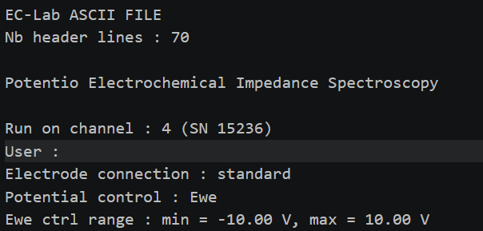<br>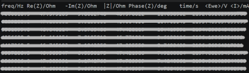 |
|   z     |   ヘッダーあり または ヘッダーなし   |   Freq(Hz)  Z’(a)  Z''(b)   | 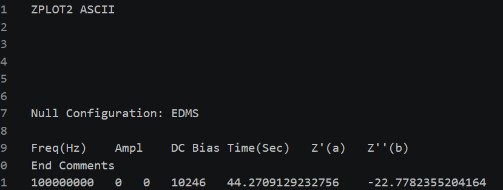 |
|   txt   |   ヘッダーなし   |   freq/Hz  Re(Z)/Ohm  \-Im(Z)/Ohm  freq/Hz  Re(Z)/Ohm  Im(Z)/Ohm  Freq(Hz)  Z’(a)  Z''(b)   | 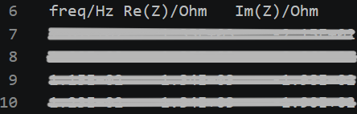 |

## 導電率測定データ詳細

### データ種別（total / bulk / gb）

導電率データは以下の3種類で構成される。

* **conductivity_total**：試料全体の導電率
* **conductivity_bulk**：粒内（bulk）成分の導電率
* **conductivity_gb**：粒界（grain boundary）成分の導電率

※ bulk および gb は任意項目であり、total のみの登録も可能である。

---

### CSVファイル構成（列名仕様）

導電率データファイルは、以下の列名を持つCSV形式で作成する。


| 列名    | 必須   | 内容   | 備考 |
| ----------------------- | ------------ | ------------------ | ---- |
| Temperature (C)   | 必須 | 温度（℃）    | Temperature (C)、Temperature (K)のいずれかは必須です。一方が空欄の場合は、もう一方を単位変換して算出します。 |
| Temperature (K)   | 必須 | 温度（K）    |  |
| Resistivity (Ohm) | 任意   | 抵抗率 |  |
| Conductivity (S/cm)     | 必須   | 導電率 |  |
| 1000/T (K^-1)     | 任意   | 1000/T | 空白の場合はTemperature (K)から算出します。 |
| log sigma (S cm^-1)     | 任意   | log σ  | 空白の場合はConductivity (S/cm)から算出します。 |
| log sigma T (K S cm^-1) | 任意   | log(σT)| 空白の場合はTemperature (K)とConductivity (S/cm)から算出します。 |
| Impedance File    | 任意   | 対応インピーダンスファイル名 | 対応するインピーダンスファイル名を記入すると、インピーダンスファイルメタに温度が追加されます。 |

例：  
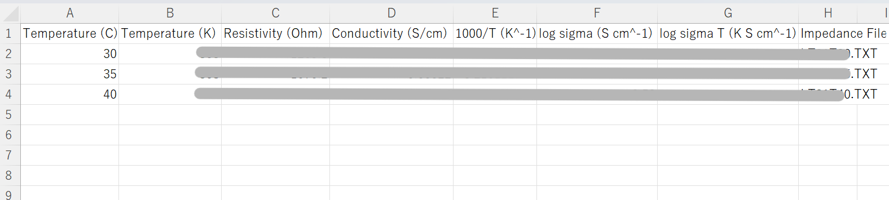 

---

### 必須ファイル要件

- conductivity_total*.csv は導電率CSVを単独登録時に必須(bulk または gb があるなら total も必須)
- 導電率CSV登録時には、異なる温度条件(Temperature (C) および　Temperature (K))における導電率データを最低3点以上含める必要があります。
- Arrhenius解析（活性化エネルギー算出）は、温度条件が3点未満の場合エラーが発生し、処理は中断されます。

## 出力ファイル詳細

| No | ファイル種別    | ファイル名   | 内容    | 備考  |
| -- | --------------- | ------------------------- | ---------- | ------------ |
| 1  | 非共有rawデータファイル   | ・*conductivity_total*.csv などの`導電率データファイル`<br> ・*.mpt、*.z、*.txt などの`インピーダンスファイル` | 送り状から入力されたファイル   |     |
| 2  | 主要パラメータメタ情報ファイル | metadata.json | mata情報ファイル  | 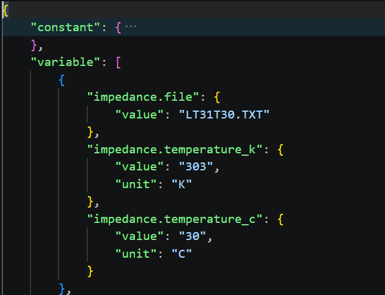  |
| 3  | 構造化ファイル   | {導電率データファイル名}_calc.csv    | 導電率データファイルの欠損値を補完したもの   | 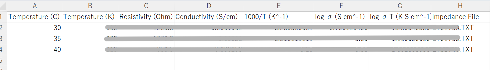 |
| 4  | 構造化ファイル   | {導電率データファイル名}_fit.csv     | 導電率データファイルのうちフィッティングに使用したデータ  | 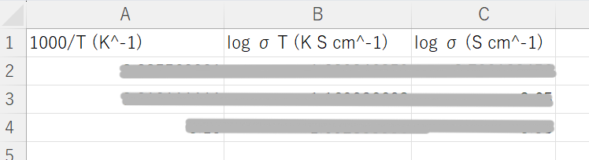   |
| 5  | 構造化ファイル   | {インピーダンスファイル名（拡張子含む）}_calc.csv  | インピーダンスデータファイルのデータ部     | 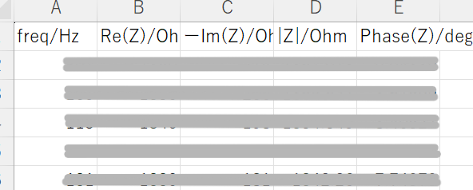   |
| 6  | 構造化ファイル   | {インピーダンスファイル名（拡張子含む）}_data.csv  | インピーダンスデータファイルのデータ部からプロットに必要なデータを抽出し、欠損値を補完したもの | 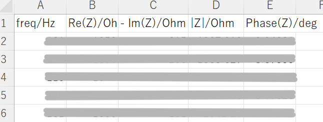   |
| 7  | 構造化ファイル   | {インピーダンスファイル名（拡張子含む）}_norm.csv  | {インピーダンスファイル名（拡張子含む）}_data をインピーダンス規格化したもの| 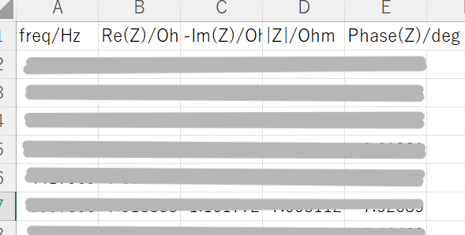   |
| 8  | 構造化ファイル   | eisdata.html                    　     | すべてのpng画像ファイルを１つにまとめてplotlyでhtml出力したもの    | 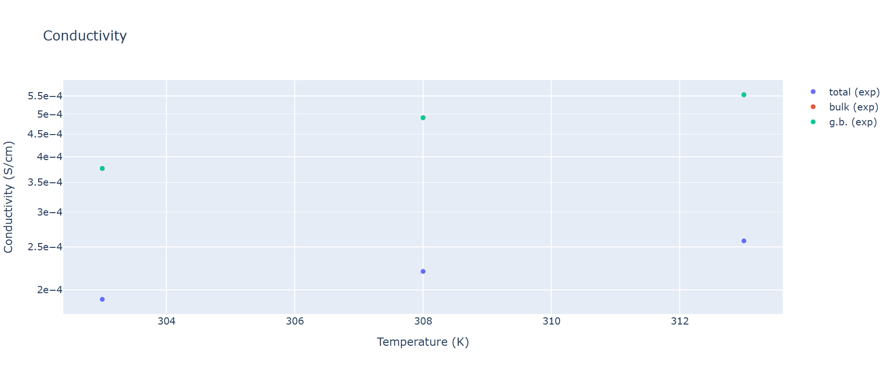    |
| 9  | 構造化ファイル   | structured_log.txt  | 構造化処理ログファイル | 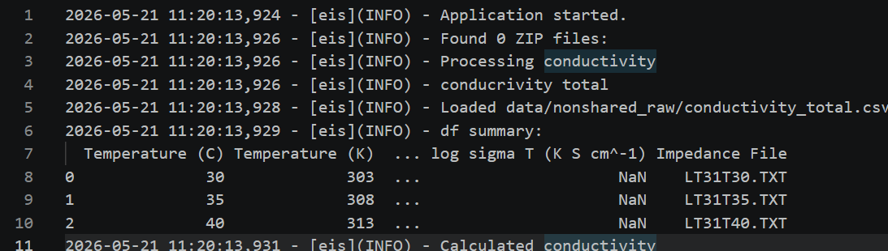   |
| 10 | 代表画像ファイル  | conductivity_arrhenius_fit_log_sigma_t.png <br> または、 cole_cole.png  | 導電率データファイルが入力された場合は、log σTのフィッティングありのアレニウスプロット画像 <br> 入力がインピーダンスデータだけの場合は、Cole-Coleプロット画像 | 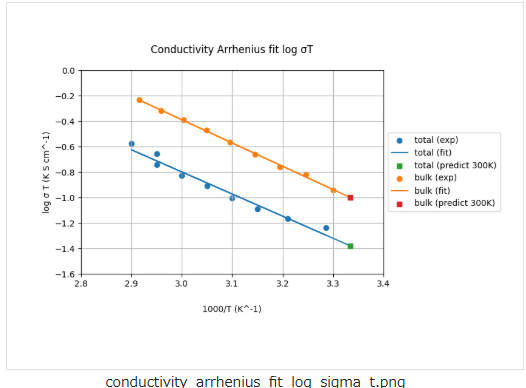     |
| 11 | 画像ファイル    | conductivity.png    | 生データプロット（導電率データが入力された場合のみ出力）    | 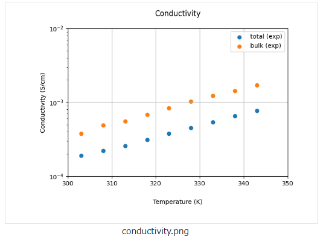  |
| 12 | 画像ファイル    | conductivity_arrhenius_fit_log_sigma.png    | log σ を用いた導電率成分の複合アレニウスプロットと近似線（導電率データが入力された場合のみ出力）     | 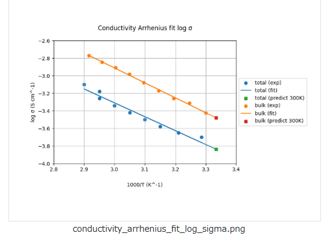    |
| 13 | 画像ファイル    | conductivity_arrhenius_log_sigma.png  | log σ を用いた導電率成分の複合アレニウスプロット（導電率データが入力された場合のみ出力）   | 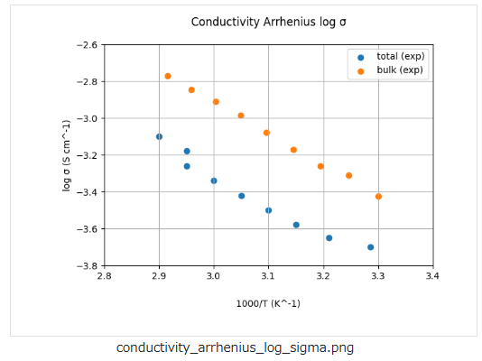 |
| 14 | 画像ファイル    | conductivity_arrhenius_log_sigma_t.png| log σT を用いた導電率成分の複合アレニウスプロット（導電率データが入力された場合のみ出力）  | 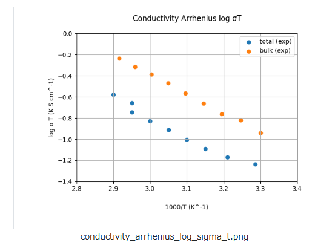  |
| 15 | 画像ファイル | conductivity_total_arrhenius_fit_log_sigma.png | log σ を用いた導電率成分別(total,bulk,gb)の Arrhenius プロットと近似線 （Total 導電率データが入力された場合のみ出力） | 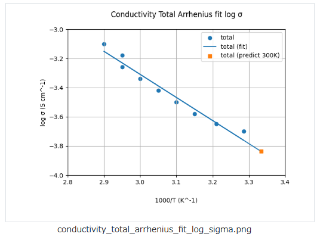 |
| 16 | 画像ファイル | conductivity_total_arrhenius_fit_log_sigma_t.png | log σT を用いた導電率成分別(total,bulk,gb)の Arrhenius プロットと近似線 （Total 導電率データが入力された場合のみ出力） | 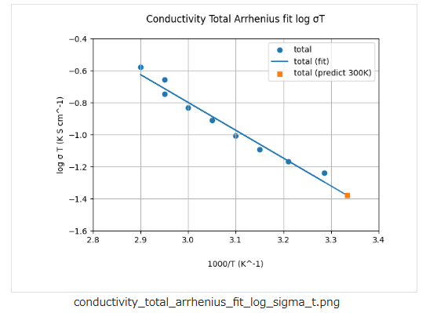 |
| 17 | 画像ファイル | conductivity_bulk_arrhenius_fit_log_sigma.png | log σ を用いた導電率成分別(total,bulk,gb)の Arrhenius プロットと近似線 （Bulk 導電率データが入力された場合のみ出力） | 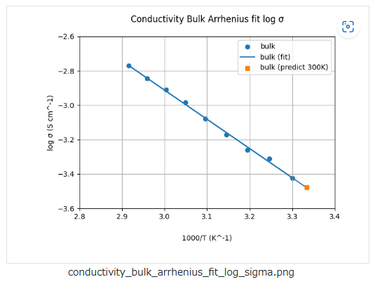 |
| 18 | 画像ファイル | conductivity_bulk_arrhenius_fit_log_sigma_t.png | log σT を用いた導電率成分別(total,bulk,gb)の Arrhenius プロットと近似線 （Bulk 導電率データが入力された場合のみ出力） | 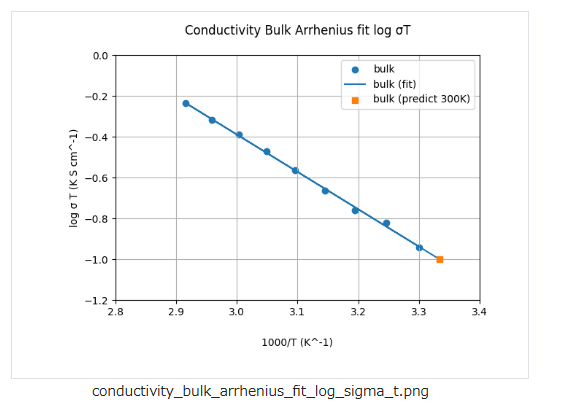 |
| 19 | 画像ファイル | conductivity_gb_arrhenius_fit_log_sigma.png | log σ を用いた導電率成分別(total,bulk,gb)の Arrhenius プロットと近似線 （Grain-Boundary 導電率データが入力された場合のみ出力） | 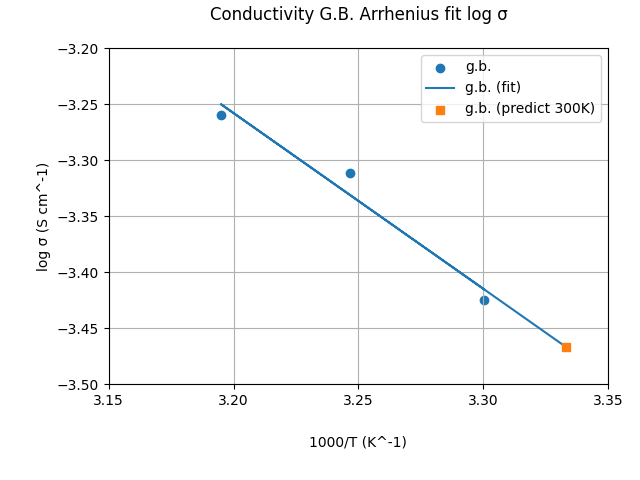 |
| 20 | 画像ファイル | conductivity_gb_arrhenius_fit_log_sigma_t.png | log σT を用いた導電率成分別(total,bulk,gb)の Arrhenius プロットと近似線 （Grain-Boundary導電率データが入力された場合のみ出力） | 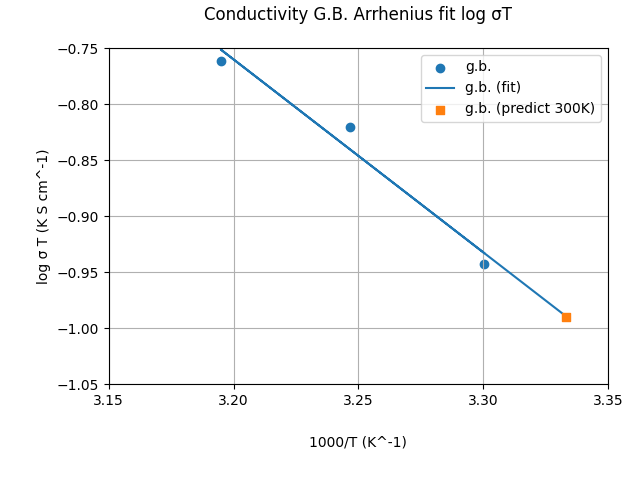 |
| 17 | 画像ファイル    | cole_cole.png | Cole-Coleプロット （インピーダンスデータが入力された場合のみ出力）    | 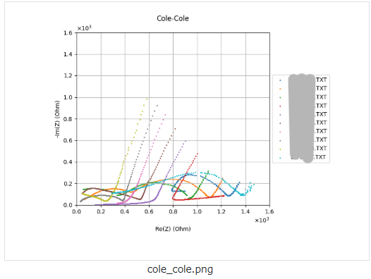 |
| 18 | 画像ファイル    | bode_magnitude.png  | Bode Magnitude プロット（インピーダンスデータが入力された場合のみ出力）     | 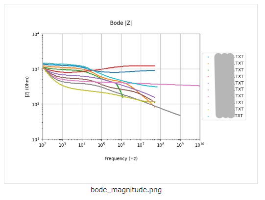   |
| 19 | 画像ファイル    | bode_phase.png| Bode Phase プロット（インピーダンスデータが入力された場合のみ出力）   | 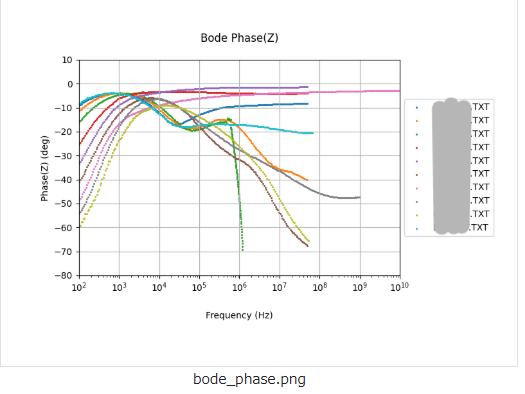     |
| 20 | 画像ファイル    | bode_phase_inverted.png   | Y 軸を反転させた Bode Phase プロット （インピーダンスデータが入力された場合のみ出力）    | 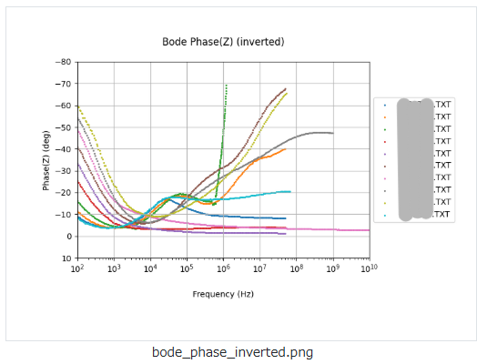    |
| 21 | 画像ファイル    | cole_cole_normalized.png  | インピーダンス規格化した Cole-Cole プロット（インピーダンスデータが入力された場合のみ出力）   | 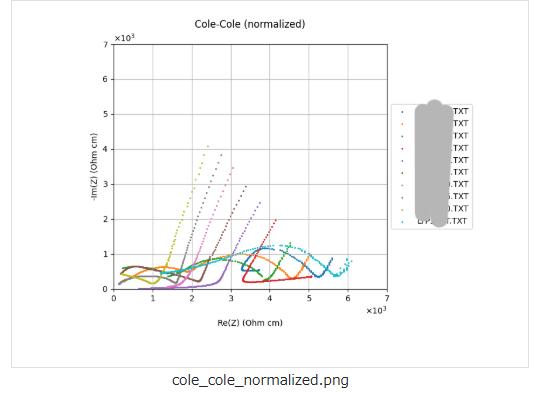  |
| 22 | 画像ファイル    | bode_magnitude_normalized.png   | インピーダンス規格化した Bode Magnitude プロット（インピーダンスデータが入力された場合のみ出力）    | 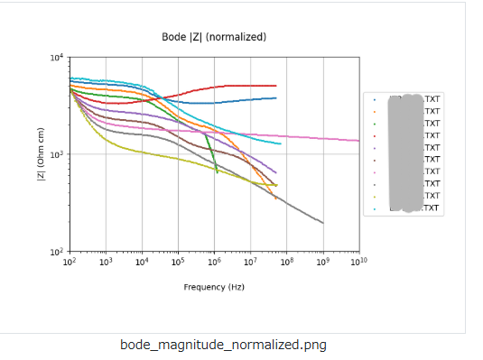    |
| 23 | 画像ファイル    | bode_phase_normalized.png | インピーダンス規格化した Bode Phase プロット（インピーダンスデータが入力された場合のみ出力）  | 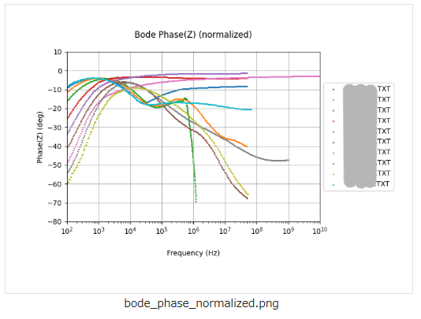|
| 24 | 画像ファイル    | bode_phase_inverted_normalized.png    | インピーダンス規格化した Y 軸を反転させた Bode Phase プロット（インピーダンスデータが入力された場合のみ出力）    | 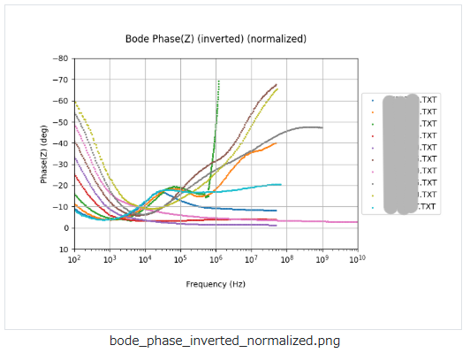     |


### メタ情報

次のように、大きく4つに分類されます。

- 基本情報
- 固有情報
- 試料情報
- 抽出メタ情報

#### 基本情報

基本情報はすべてのデータセットテンプレート共通のメタです。詳細は[データセット閲覧 RDE Dataset Viewer > マニュアル](https://dice.nims.go.jp/services/RDE/RDE_manual.pdf)を参照してください。

#### 固有情報

固有情報はデータセットテンプレート特有のメタです。以下は本データセットテンプレートに設定されている固有メタ情報項目です。

| 項目名     | 必須  | 日本語名 | 英語名| データ型 | 初期値| 単位  | 備考|
| ------------------------- | --- | ---------- | ------------------ | ------------- | -------------- | --- | ------------- |
| pellet.diameter  |  | ペレット直径  | Pellet Diameter| string  | -  | cm  | - |
| pellet.area|  | ペレット面積  | Pellet Area | string  | -  | cm² | - |
| pellet.thickness |  | ペレット厚さ  | Pellet Thickness  | string  | -  | cm  | - |
| common_data_type |  | 登録データタイプ| Data Type| string  | EIS| -| - |
| common_data_origin  |  | データの起源  | Data Origin | string  | experiments | -| - |
| common_technical_category |  | 技術カテゴリー | Technical Category| string  | measurement | -| - |
| common_reference |  | 参考文献 | Reference| string  | -  | -| - |
| measurement_method_category  |  | 計測法カテゴリー| Method category| string  | 電気化学  | -| - |
| measurement_method_sub_category |  | 計測法サブカテゴリー | Method sub-category  | string  | 電気化学インピーダンス分光法 | -| - |
| measurement_analysis_field|  | 分析分野 | Analysis field | string  | -  | -| - |
| measurement_measurement_environment|  | 測定環境 | Measurement environment | string  | -  | -| - |
| measurement_energy_level_transition_structure_etc_of_interest |  | 対象準位_遷移_構造 | Energy Level_Transition_Structure etc. of interest | string  | -  | -| - |
| measurement_measured_date |  | 分析年月日| Measured date  | string (date) | -  | -| ISO 8601 日付形式 |
| measurement_standardized_procedure |  | 標準手順 | Standardized procedure  | string  | -  | -| - |
| measurement_instrumentation_site|  | 装置設置場所  | Instrumentation site | string  | -  | -| - |


#### 試料情報

試料情報は試料に関するメタで、試料マスタ（[データセット閲覧 RDE Dataset Viewer > マニュアル](https://dice.nims.go.jp/services/RDE/RDE_manual.pdf)参照）と連携しています。以下は本データセットテンプレートに設定されている試料メタ情報項目です。

|項目名|必須|日本語名|英語名|単位|初期値|データ型|フォーマット|備考|
|:----|:----|:----|:----|:----|:----|:----|:----|:----|
|sample_name_(local_id)|o|試料名(ローカルID)|Sample name (Local ID)|||string|||
|chemical_formula_etc.||化学式・組成式・分子式など|Chemical formula etc.|||string|||
|administrator_(affiliation)|o|試料管理者(所属)|Administrator (Affiliation)|||string|||
|reference_url||参考URL|Reference URL|||string|||
|related_samples||関連試料|Related samples|||string|||
|tags||タグ|Tags|||string|||
|description||試料の説明|Description |||string|||
|sample.general.general_name||一般名称|General name|||string|||
|sample.general.cas_number||CAS番号|CAS Number|||string|||
|sample.general.crystal_structure||結晶構造|Crystal structure|||string|||
|sample.general.sample_shape||試料形状|Sample shape|||string|||
|sample.general.purchase_date||試料購入日|Purchase date|||string|||
|sample.general.supplier||購入元|Supplier|||string|||
|sample.general.lot_number_or_product_number_etc||ロット番号、製造番号など|Lot number or product number etc|||string|||

#### 抽出メタ

抽出メタ情報は、データファイルから構造化処理で抽出したメタデータです。以下は本データセットテンプレートに設定されている抽出メタ情報項目です。入力フォーマット別に表示します。


| 項目名 | 取得元 | 日本語名 | 英語名 | データ型 | 単位 | 初期値 | 備考 |
|--------|--------|----------|--------|----------|------|--------|------|
| conductivity.total.approximate_formula.log_sigma_t | conductivity_total ファイルの値から算出 | 導電率 total 近似式 (fit by logσT) | Conductivity total Approximate Formula (fit by logσT) | string | - | - | - |
| conductivity.total.activation_energy_ev.log_sigma_t | conductivity_total ファイルの値から算出 | 活性化エネルギー total (eV) (fit by logσT) | Activation Energy total (eV) (fit by logσT) | number | eV | - | - |
| conductivity.total.activation_energy_kjmol.log_sigma_t | conductivity_total ファイルの値から算出 | 活性化エネルギー total (KJ/mol) (fit by logσT) | Activation Energy total (KJ/mol) (fit by logσT) | number | KJ/mol | - | - |
| conductivity.total.conductivity_300k.log_sigma_t | conductivity_total ファイルの値から算出 | 導電率 at 300K total (fit by logσT) | Conductivity at 300K total (fit by logσT) | number | S/cm | - | - |
| conductivity.total.preexponetial_term.log_sigma_t | conductivity_total ファイルの値から算出 | 前指数項 total (fit by logσT) | Pre-exponential Term total (fit by logσT) | number | - | - | - |
| conductivity.bulk.approximate_formula.log_sigma_t | conductivity_bulk ファイルの値から算出 | 導電率 bulk 近似式 (fit by logσT) | Conductivity bulk Approximate Formula (fit by logσT) | string | - | - | - |
| conductivity.bulk.activation_energy_ev.log_sigma_t | conductivity_bulk ファイルの値から算出 | 活性化エネルギー bulk (eV) (fit by logσT) | Activation Energy bulk (eV) (fit by logσT) | number | eV | - | - |
| conductivity.bulk.activation_energy_kjmol.log_sigma_t | conductivity_bulk ファイルの値から算出 | 活性化エネルギー bulk (KJ/mol) (fit by logσT) | Activation Energy bulk (KJ/mol) (fit by logσT) | number | KJ/mol | - | - |
| conductivity.bulk.conductivity_300k.log_sigma_t | conductivity_bulk ファイルの値から算出 | 導電率 at 300K bulk (fit by logσT) | Conductivity at 300K bulk (fit by logσT) | number | S/cm | - | - |
| conductivity.bulk.preexponetial_term.log_sigma_t | conductivity_bulk ファイルの値から算出 | 前指数項 bulk (fit by logσT) | Pre-exponential Term bulk (fit by logσT) | number | - | - | - |
| conductivity.gb.approximate_formula.log_sigma_t | conductivity_gb ファイルの値から算出 | 導電率 粒界 近似式 (fit by logσT) | Conductivity grain boundary Approximate Formula (fit by logσT) | string | - | - | - |
| conductivity.gb.activation_energy_ev.log_sigma_t | conductivity_gb ファイルの値から算出 | 活性化エネルギー 粒界 (eV) (fit by logσT) | Activation Energy grain boundary (eV) (fit by logσT) | number | eV | - | - |
| conductivity.gb.activation_energy_kjmol.log_sigma_t | conductivity_gb ファイルの値から算出 | 活性化エネルギー 粒界 (KJ/mol) (fit by logσT) | Activation Energy grain boundary (KJ/mol) (fit by logσT) | number | KJ/mol | - | - |
| conductivity.gb.conductivity_300k.log_sigma_t | conductivity_gb ファイルの値から算出 | 導電率 at 300K 粒界 (fit by logσT) | Conductivity at 300K grain boundary (fit by logσT) | number | S/cm | - | - |
| conductivity.gb.preexponetial_term.log_sigma_t | conductivity_gb ファイルの値から算出 | 前指数項 粒界 (fit by logσT) | Pre-exponential Term grain boundary (fit by logσT) | number | - | - | - |
| conductivity.total.approximate_formula.log_sigma | conductivity_total ファイルの値から算出 | 導電率 total 近似式 (fit by logσ) | Conductivity total Approximate Formula (fit by logσ) | string | - | - | - |
| conductivity.total.activation_energy_ev.log_sigma | conductivity_total ファイルの値から算出 | 活性化エネルギー total (eV) (fit by logσ) | Activation Energy total (eV) (fit by logσ) | number | eV | - | - |
| conductivity.total.activation_energy_kjmol.log_sigma | conductivity_total ファイルの値から算出 | 活性化エネルギー total (KJ/mol) (fit by logσ) | Activation Energy total (KJ/mol) (fit by logσ) | number | KJ/mol | - | - |
| conductivity.total.conductivity_300k.log_sigma | conductivity_total ファイルの値から算出 | 導電率 at 300K total (fit by logσ) | Conductivity at 300K total (fit by logσ) | number | S/cm | - | - |
| conductivity.total.preexponetial_term.log_sigma | conductivity_total ファイルの値から算出 | 前指数項 total (fit by logσ) | Pre-exponential Term total (fit by logσ) | number | - | - | - |
| conductivity.bulk.approximate_formula.log_sigma | conductivity_bulk ファイルの値から算出 | 導電率 bulk 近似式 (fit by logσ) | Conductivity bulk Approximate Formula (fit by logσ) | string | - | - | - |
| conductivity.bulk.activation_energy_ev.log_sigma | conductivity_bulk ファイルの値から算出 | 活性化エネルギー bulk (eV) (fit by logσ) | Activation Energy bulk (eV) (fit by logσ) | number | eV | - | - |
| conductivity.bulk.activation_energy_kjmol.log_sigma | conductivity_bulk ファイルの値から算出 | 活性化エネルギー bulk (KJ/mol) (fit by logσ) | Activation Energy bulk (KJ/mol) (fit by logσ) | number | KJ/mol | - | - |
| conductivity.bulk.conductivity_300k.log_sigma | conductivity_bulk ファイルの値から算出 | 導電率 at 300K bulk (fit by logσ) | Conductivity at 300K bulk (fit by logσ) | number | S/cm | - | - |
| conductivity.bulk.preexponetial_term.log_sigma | conductivity_bulk ファイルの値から算出 | 前指数項 bulk (fit by logσ) | Pre-exponential Term bulk (fit by logσ) | number | - | - | - |
| conductivity.gb.approximate_formula.log_sigma | conductivity_gb ファイルの値から算出 | 導電率 粒界 近似式 (fit by logσ) | Conductivity grain boundary Approximate Formula (fit by logσ) | string | - | - | - |
| conductivity.gb.activation_energy_ev.log_sigma | conductivity_gb ファイルの値から算出 | 活性化エネルギー 粒界 (eV) (fit by logσ) | Activation Energy grain boundary (eV) (fit by logσ) | number | eV | - | - |
| conductivity.gb.activation_energy_kjmol.log_sigma | conductivity_gb ファイルの値から算出 | 活性化エネルギー 粒界 (KJ/mol) (fit by logσ) | Activation Energy grain boundary (KJ/mol) (fit by logσ) | number | KJ/mol | - | - |
| conductivity.gb.conductivity_300k.log_sigma | conductivity_gb ファイルの値から算出 | 導電率 at 300K 粒界 (fit by logσ) | Conductivity at 300K grain boundary (fit by logσ) | number | S/cm | - | - |
| conductivity.gb.preexponetial_term.log_sigma | conductivity_gb ファイルの値から算出 | 前指数項 粒界 (fit by logσ) | Pre-exponential Term grain boundary (fit by logσ) | number | - | - | - |
| impedance.file | インピーダンスファイル名 | インピーダンス ファイル | Impedance File | string | - | - | variable項目 |
| impedance.temperature_k | conductivity_total ファイルの Temperature (K) | インピーダンス 温度 (K) | Impedance Temperature (K) | string | K | - | variable、(conductivity_XXX.csvから取得。記載がなければ空) |
| impedance.temperature_c | conductivity_total ファイルの Temperature (C) | インピーダンス 温度 (C) | Impedance Temperature (C) | string | C | - | variable、(conductivity_XXX.csvから取得。記載がなければ空) |
| impedance.mpt.acquisition_started_on | mpt ファイルの Acquisition started on : | インピーダンス Acquisition started on | Impedance Acquisition started on | string | - | - | variable項目 |
| impedance.mpt.technique_started_on | mpt ファイルの Technique started on : | インピーダンス Technique started on | Impedance Technique started on | string | - | - | variable項目 |
| impedance.mpt.potential_control | mpt ファイルの Potential control : | インピーダンス Potential control | Impedance Potential control | string | - | - | variable項目 |
| impedance.mpt.ewe_ctrl_range_min | mpt ファイルの Ewe ctrl range : | インピーダンス Ewe ctrl range min | Impedance Ewe ctrl range min | string | V | - | variable項目 |
| impedance.mpt.ewe_ctrl_range_max | mpt ファイルの Ewe ctrl range : | インピーダンス Ewe ctrl range max | Impedance Ewe ctrl range max | string | V | - | variable項目 |
| impedance.mpt.ewe_I_filtering | mpt ファイルの Ewe I filtering : | インピーダンス Ewe,I filtering | Impedance Ewe,I filtering | string | kHz | - | variable項目 |
| impedance.mpt.device | mpt ファイルの Device : | インピーダンス Device | Impedance Device | string | - | - | variable項目 |
| impedance.mpt.software | mpt ファイルの (software) | インピーダンス Software | Impedance Software | string | - | - | variable項目 |


## データカタログ項目


データカタログの項目です。データカタログはデータセット管理者がデータセットの内容を第三者に説明するためのスペースです。

|RDE2.0用パラメータ名|日本語名|英語名|データ型|備考|
|:----|:----|:----|:----|:----|
|dataset_title|データセット名|Dataset Title|string||
|abstract|概要|Abstract|string||
|data_creator|作成者|Data Creator|string||
|language|言語|Language|string||
|experimental_apparatus|使用装置|Experimental Apparatus|string||
|data_distribution|データの再配布|Data Distribution|string||
|raw_data_type|データの種類|Raw Data Type|string||
|raw_data_size|格納データ|Stored Data|string||
|remarks|備考|Remarks|string||
|references|参考論文|References|string||
|key1|キー1|key1|string|汎用項目|
|key2|キー2|key2|string|汎用項目|
|key3|キー3|key3|string|汎用項目|
|key4|キー4|key4|string|汎用項目|
|key5|キー5|key5|string|汎用項目|

## 構造化処理の詳細

### 設定ファイルの説明

構造化処理を行う際の、設定ファイル(`rdeconfig.yaml`)の項目についての説明です。

| 階層 | 項目名 | 語彙 | データ型 | 標準設定値 | 備考 |
|:----|:----|:----|:----|:----|:----|
| system | extended_mode |	動作モード	| string |	なし | |
| system | save_raw | 入力ファイル公開・非公開 | string | 'false' | 公開したい場合は'true'に設定。エンバーゴ期間終了後にファイルが公開されます。 |
| system | save_thumbnail_image | サムネイル画像保存 | string | 'true' | |
| sem | manufacturer | 装置メーカー名 | string | 'Biologic' or 'Scribner' or 'Custom' | |


## dataset関数の説明（EIS）

設定ファイルを読み込み、EISデータの製造元（manufacturer）に応じて処理モードを切り替えます。
対応しているモードは **Biologic モード、Scribner モード、Custom モード** の3種類です。

* 設定ファイルについては、[こちら](#設定ファイルの説明) を参照してください。

```python
config = EisFactory.get_config(srcpaths.tasksupport)
module = EisFactory.get_objects(srcpaths.tasksupport, config)
```

設定ファイル内の `eis.manufacturer` の値に基づき、対応するファイル読み込み・解析クラスを取得します。
未対応の manufacturer が指定された場合はエラーとなります。

---

### ZIPファイルの展開

入力ファイルが zip 形式の場合、自動的に展開します。

```python
module.file_reader.get_unzipped_filepaths(raw_files_directory)
```

---

### 導電率データの処理

導電率計算用CSVファイルが存在する場合、導電率解析を実行します。
解析結果として、導電率プロットや温度依存データを生成します。

```python
cond_figs, _calc_dfs, fit_s, fit_st, total = eisdata.process_conductivity(
    csv_paths,
    resource_paths.struct,
    resource_paths.main_image,
    resource_paths.other_image,
)
```

生成されたデータは、後続のインピーダンス解析やメタデータ生成にも利用されます。

---

### インピーダンスデータの読み込み

.mpt / .z / .txt などのインピーダンスファイルを読み込みます。
ヘッダー部と測定データ部を分離し、不足列がある場合は自動計算で補完します。

```python
lines = module.file_reader.load_impedance_file(imp_path)

header, data = module.file_reader.split_impedance_header_and_data(lines)

data = module.file_reader.extract_and_calculate_missing_columns(data)
```

補完対象には、|Z|、phase、Re(Z)、Im(Z) などが含まれます。

---

### インピーダンス解析・可視化

読み込んだインピーダンスデータを用いて、NyquistプロットやBodeプロットを生成します。
生成画像は main_image / other_image ディレクトリへ保存されます。

```python
imp_header, imp_figs, imp_print_figs = eisdata.process_impedance(
    imp_data,
    resource_paths.struct,
    resource_paths.other_image,
    resource_paths.main_image,
    save_to_mainimage,
    total_calc_df,
    pellet_diameter,
    pellet_area,
    pellet_thickness,
)
```

---

### HTMLレポート生成

導電率解析およびインピーダンス解析結果をまとめた HTML レポートを生成します。

```python
eisdata.create_combined_html(
    figs,
    print_figs,
    Path(resource_paths.struct, 'eisdata.html')
)
```

---

### メタデータの解析と保存

解析結果および測定条件を解析し、
`metadata-def.json` に基づいて `metadata.json` を生成します。

```python
const_meta_info, repeated_meta_info = module.meta_parser.parse(
    cond_meta,
    imp_header,
    total_calc_df
)

module.meta_parser.save_meta(
    resource_paths.meta.joinpath("metadata.json"),
    Meta(srcpaths.tasksupport.joinpath("metadata-def.json")),
    const_meta_info=const_meta_info,
    repeated_meta_info=repeated_meta_info,
)
```

---

### 試料情報（pellet情報）の取得

送り状（invoice.json）に pellet diameter / area / thickness が記載されている場合、
解析メタデータへ自動的に反映します。

```python
module.meta_parser.inject_pellet_info_from_invoice(
    const_meta_info,
    resource_paths.invoice_org
)
```
